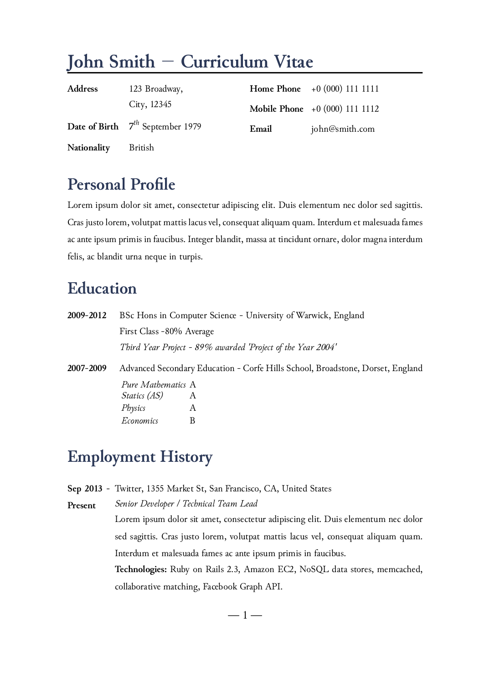

cv-satysfi
==========

[](https://github.com/MasWag/cv-satysfi/actions)
[](./LICENSE)
[](https://satyrographos-packages.netlify.app/packages/class-cv)


This is a class in [SATySFi](https://github.com/gfngfn/SATySFi) for Curriculum Vitae. The layout is taken from [Wilson Resume/CV](https://github.com/watsonbox/cv_template_2004). The typesetting is not as good as the original and any contribution is welcome.



Dependencies
------------

- [SATySFi](https://github.com/gfngfn/SATySFi)
- [satyrographos](https://github.com/na4zagin3/satyrographos)

How to Build the Example
------------------------

```shell
opam pin add satysfi-class-cv.opam "file://$PWD"
satyrographos install
satysfi ./examples/example.saty
```

